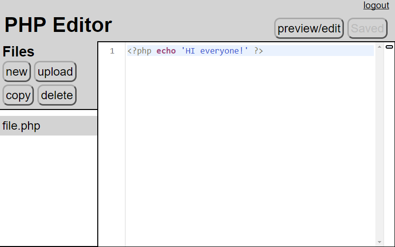

# SharedServerPhpEditor
A little web-based PHP editor that's useful for setting up a server for teaching PHP. 

The goal is to let you set-up a Linux server with each student having a separate `public_html` user directory for their own website. This little PHP editor can then be dropped into their `public_html` directories, so all the students will have to do is visit their own website to find an online editor that they can use to create and edit PHP files. This way, a teacher only has to start-up a single teaching server in the cloud somewhere, let students practice their PHP there, and then the teacher can discard it right afterwards. Students don't have to install anything or learn anything about the Cloud or deal with server management etc. They just visit their website and can immediately start coding some PHP.

It's meant primarily for short interactive demo sessions or in-class tutorials about PHP. It's not a full-featured editor. It simply takes the [Eclipse Orion editor](https://wiki.eclipse.org/Orion/How_Tos/Editor_Build) and hooks it up to some simple server file management code. The editor code comes from the 15.1 Orion release. The js and css files were moved into a separate `orion` directory, and the `built-editor.js` file was modified so that `var requirejs, require, define` was moved out of the closure and into global scope.

The password for logging in to the editor is stored in the file `edit/password`. You will have to create this file yourself. Since the server isn't particularly secure (and will likely be used over http where passwords can be sniffed), it's best to use a computer generated password that is only used for the class.

Note: I don't actually know any PHP, so I suspect the code is pretty awful. I'm trying to set-up the code so that it's entirely client-based with the PHP server code merely providing an API that will be invoked by the JavaScript client.

## Why Does This Exist?

It is intended as a low-cost, easy way to teach the basics of server side programming to some students. Installing server-side software directly to student machines is time-consuming and complicated. It's possible to bring up separate, preconfigured servers in the cloud for each student, but that can be expensive if you have a lot of students. With this little PHP editor, only a single shared server has to be brought up in the cloud and all the students can use it.

## Setting Up a Server

### Installing and configuring Apache, PHP, etc.

Here are the instructions for setting up such a server using Ubuntu 16.04. You can easily install Ubuntu on a machine. If you launch such a server on Amazon's EC2 or elsewhere in the cloud, make sure you enable port 80:

Once you login in as the default user (usually `ubuntu`), you should download the shared server code using

    > git clone https://github.com/my2iu/SharedServerPhpEditor.git

Assuming that you are working from a blank Ubuntu install, you need to install some extra packages for the web server and PHP. You can do that by running:

    > cd SharedServerPhpEditor
    > sudo sh setupUbuntu.sh

(You can also manually execute each line of the package installation yourself if you feel safer that way.)

Next, you need to edit some configuration files. Open the file `/etc/apache2/mods-available/php7.0.conf` in an editor using

    > sudo nano /etc/apache2/mods-available/php7.0.conf

Find the line 

    php_admin_flag engine Off

and comment it out by putting a `#` in front. This change enables PHP in student directories.

    # php_admin_flag engine Off

Save and exit nano by type ctrl-O to save, pressing enter to confirm, and then ctrl-X to exit. 

Open the file `/etc/apache2/mods-enabled/userdir.conf` in an editor using

    > sudo nano /etc/apache2/mods-enabled/userdir.conf

Find the `<Directory ...` section and add the line `RMode stat` to it. It should look something like this:

    <Directory /home/*/public_html>
            RMode stat
            ...
    </Directory>

This change will mean that PHP code run in student directories will run as the student, not as a common user. This helps prevent each student's code from interfering with the code from other students, and gives students a little more freedom in their PHP code to read and write files without having to do a lot of extra configuration.

Finally, open the file `/etc/php/7.0/apache2/php.ini` in an editor using

    > sudo nano /etc/php/7.0/apache2/php.ini

Find the line

    display_errors = Off

It's a large configuration file, so might want to do a search by using ctrl-W. Once you find the line, change it to

    display_error = On

This will enable error messages in PHP. This is needed to help students debug their PHP code. Afterwards, save your changes and exit nano.

Now you should restart the Apache web server so that it picks up all the changes that you've made. Do this using

    > sudo service apache2 restart

### Setting-Up Student Accounts

We want to set-up a bunch of student accounts that will hold each student's PHP editor and their PHP programs. We assume that the server will only be used for this shared PHP server, so we will configure all user accounts to have the necessary support. Do this by running the script

    > sudo sh setupHomeDirLayout.sh

Next, we want to create a list of passwords for the students. These passwords are only for the PHP editor and not for the Linux user accounts (those accounts will not have passwords and cannot be logged into). We want these passwords in a single, central file so that we can print them out to give them to students (or you can make a script for e-mailing them to students or whatever). 

Install a password generator

    > sudo apt-get -y install apg

Generate 20 passwords using

    > sh createStudentPasswords.sh 20

That command will create a file `userpasswords.txt` with the list of student users and their passwords.

Then run

    > sudo sh setupUserAccounts.sh

to actually create each of the student accounts and copy the password information into the accounts.
